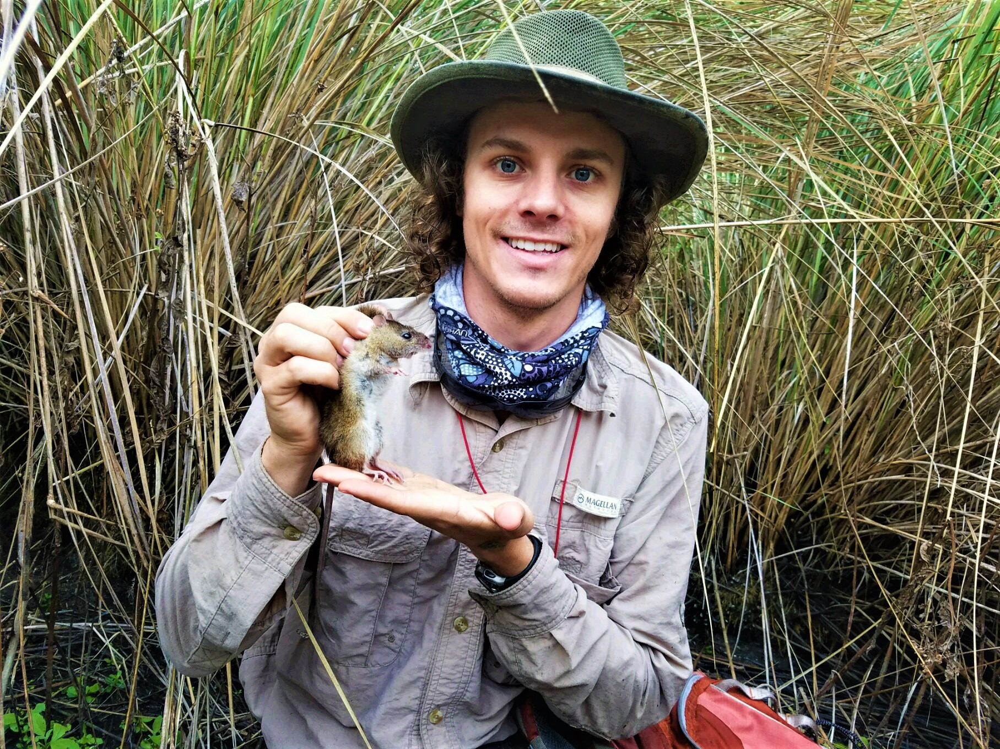

Wes earned a masters and PhD from the University of Florida, where he studied (MS) impacts of fire frequency on wildlife community composition in the longleaf pine ecosystem, and (PhD) the influence of isolation on the ecology and genetic structure of island-dwelling rodent populations. His research focuses on the conservation and management of vertebrates in human-modified landscapes. He is especially interested in how anthropogenic disturbance and restoration influence the distribution, abundance, behavior, and interspecific interactions of wildlife. Wes is currently a postdoctoral researcher at North Carolina State University where he is investigating the implications of climate change for wild turkey populations.
