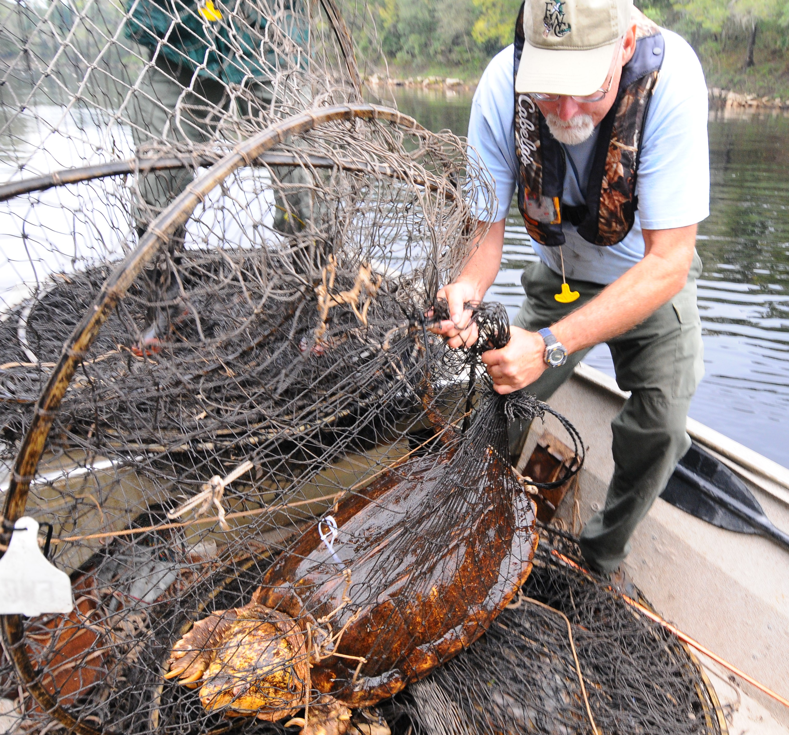

Kevin Enge received his B.S. in Wildlife and Biology from the University of Wisconsin -Stevens Point and M.S. in Wildlife Ecology from the University of Florida, Gainesville. He has worked for the Florida Fish and Wildlife Conservation Commission since 1989 and is currently a Research Scientist for the Fish and Wildlife Research Institute, where he is primarily tasked with conducting herpetofaunal surveys and assessing the status of imperiled species. He coedited the 2019 book Amphibians and Reptiles of Florida and has authored over 170 papers and 50 reports. Kevin is an integral part of the Suwannee alligator snapping turtle monitoring program.

