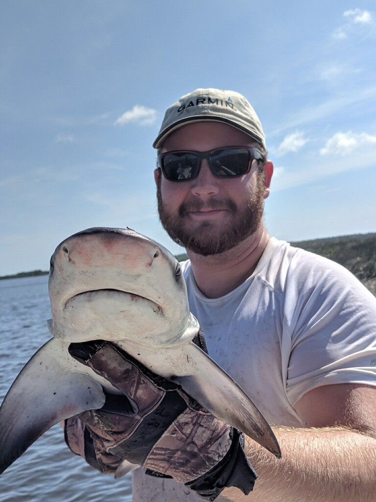

Shea is a current graduate student and research assistant at NCBS pursuing his MS in the Dept. of Wildlife Ecology and Conservation at the University of Florida. Shea is co-advised by Dr. Thomas and Dr. Johnson. Shea's MS research is primary focused on the efficacy of discrete by-catch reduction devices (BRDs) on terrapin exclusion and crab capture rates; however, he has a wide range of research interests including movement ecology, conservation ecology, and evolutionary biology of aquatic organisms. 

