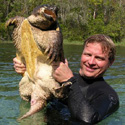

Dr. Steve Johnson is a tenured faculty member in the [Department of Wildlife Ecology and Conservation](https://wec.ifas.ufl.edu/). Before joining the University of Florida, he worked as the State Sea Turtle Program Coordinator in North Carolina, and as a research wildlife biologist with the [US Geological Survey (USGS)](https://www.usgs.gov/). At the USGS, he coordinated efforts for the national Amphibian Research and Monitoring Initiative (ARMI) in the southeastern United States. Dr. Johnson's area of expertise is natural history and conservation of amphibians and reptiles, and he has worked extensively with imperiled species. He is a member of several professional societies, including the Society for Conservation Biology, Herpetologists League, and The Wildlife Society. Also, Dr. Johnson is a renowned teacher, and he offers several courses on wildlife and conservation topics. To view Dr. Johnson's lab page click [here](https://ufwildlife.ifas.ufl.edu/steve_johnson.shtml).

