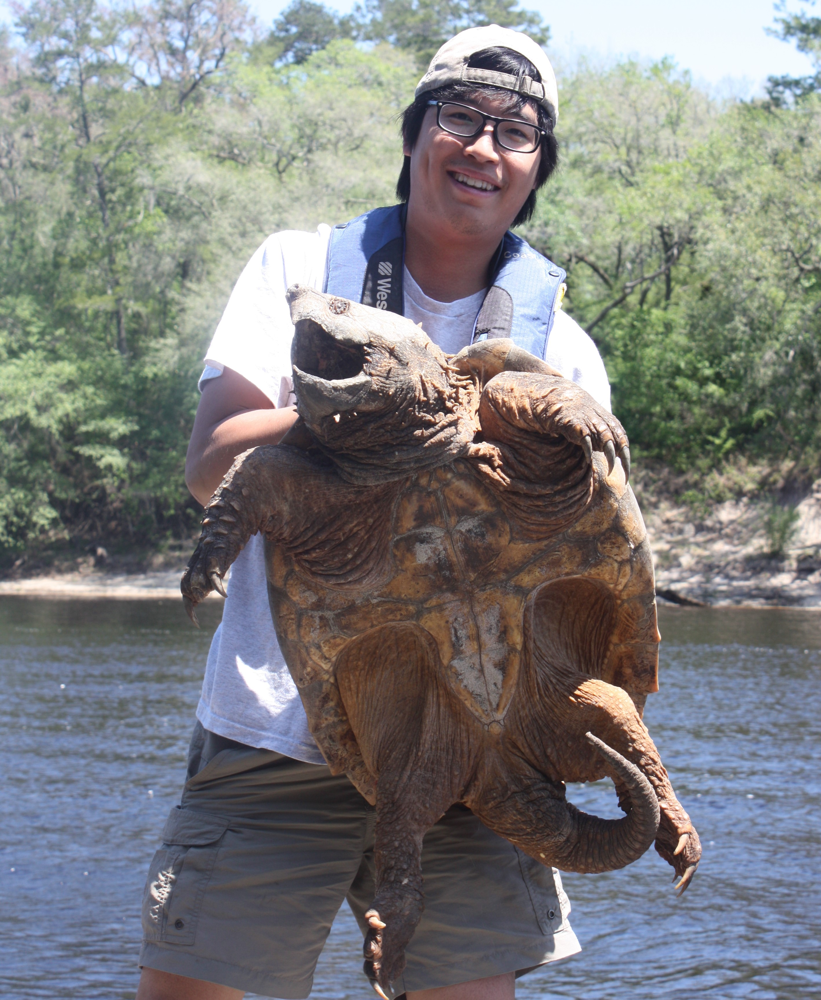

Anthony Lau is currently an Assistant Professor at Lingnan University in Hong Kong. His lab focuses mainly on introduced species in aquatic ecosystems. Previously, worked on the ecology of river turtles in Florida before moving to Asia to work on salamanders.     