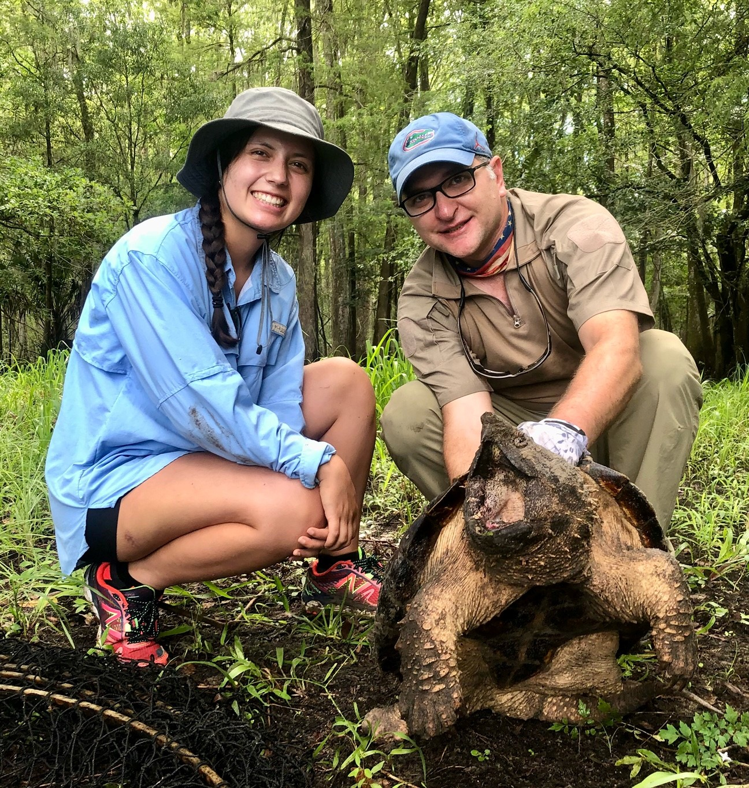
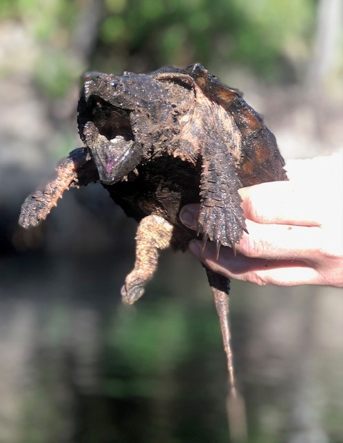

### Our latest sampling efforts in our 3 long-term sampling sites. 

Typically, we see a small drop in our capture per unit effort (CPUE) during the hot summer months. Not so fast my friends. We captured many turtles on this outing, and we even captured three turtles in our lower river site, which is about three more than we usually capture! Our summer intern Gracie had the opportunity to join us, and her hard work paid off. 

Interestingly, the water levels were pretty low in the lower and middle river, which may have made it easier for turtles to detect our baited traps. However, setting traps was actually more difficult in the middle river site because of the lower than usual water levels. Our typical tie-off areas were too shallow, but we still managed to capture six turtles in that site. Overall, we recaptured several individuals, and a few were recaptures from the original 2011-2013 study! The upper river site was productive, and we captured a stunning juvenile turtle. We don't capture many individuals in this size class, so it is really cool when we do. Perhaps, the mainstem river is not ideal for these small turtles, or our large hoop-net traps are biased towards larger individuals. Regardless, this species is spectacular looking at this size.

Also, during this expedition, we documented a population about ~40 km upriver from the extent of our upper river site. This could potentially allow us to expand our population estimate to include this area and possible lead to future study in this new site.

