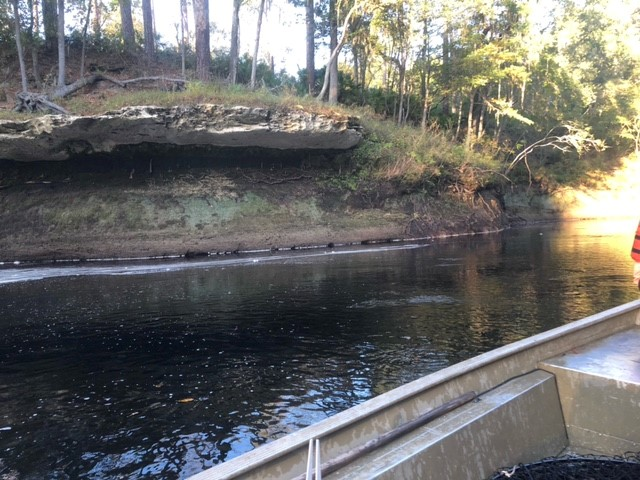
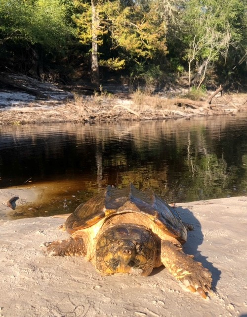
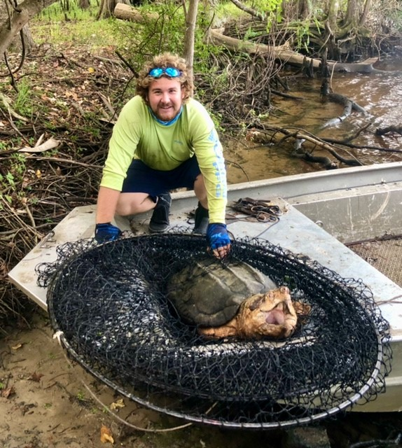
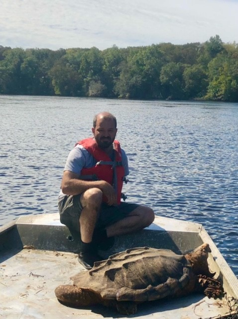

### Fall sampling in our 3 long-term sampling sites. 

The upriver site was tricky. Water levels were extremely low, and it was difficult to navigate our small johnboat. However, the low water levels revealed some amazing scenery in the form of high limestone bluffs with rocky ledges.

We only captured one turtle in 12 trap nights in the upriver site, but the medium sized male was impressive.

We had a record breaking day at our lower river site, which is typically not very productive. We captured two males > 100 lbs. Shea and Jeremy did a fantastic job of trap placement in this tidal section of river. We processed the turtles on the bank, and we were off to set another site.

Our middle river site is bonkers. Overall, We had a big day, which was boosted by having a single trap with four alligator snappers inside. We had a tough time getting the trap and turtles in the boat, and we sure were glad we had some extra hands from Dan Catizone (USGS), Josh Ringer (FWC), and Jack Thompson (UF). We ended up with six recaptures, and one individual was previously marked in 2012 at a site ~25 km upstream. The majority of turtles seem to possess extremely high site fidelity, so this is unusual in our experience. Also, this is the longest movement we have documented to date. Overall, it was a great ending to a successful year on the Suwannee.     

