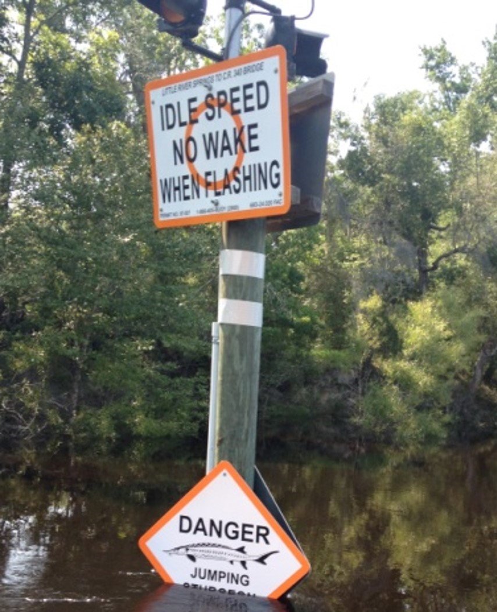
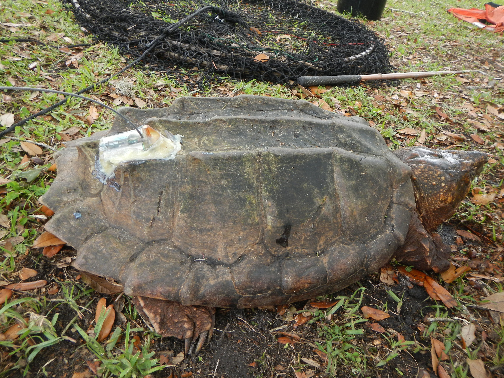

### Pilot testing satellite tags of Suwannee ASTs

Suwannee ASTs use freshwater habitats, but they require specific terrestrial habitats for nesting. We know next to nothing about nesting in this species. In fact, the best information we have comes from a study conducted in a different river system (Apalachicola River) on a different species (*M. temminckii*). Therefore, identifying even a few nesting locations could allow for some inferences on important nesting areas/habitats for the Suwannee AST, which could be prioritized for additional research and conservation efforts. We worked with our collegues at the USGS (Dr. Meg Lamont) and our partners at [Wildlife Computers Inc](https://wildlifecomputers.com/) to program and pilot test two satellite transmitters. One “off the shelf” transmitter and a modified SPASH-BF to track a couple of gravid females in the Suwannee River. Typically, satellite transmitters are used on marine animals (e.g., sea turtles, whales, sharks, dolphins, penguins, etc.), and this technology has rarely been used on freshwater turtles. So, we really don't know what to expect. We need several things to go our way. For example, we need to capture two females, but our sampling data indicates a male skewed population (3 males to every 1 female). So, we need to actually capture two female turtles. Also, we need those females to be gravid, which is why we are bringing our friends from the FWC Wildlife Health to X-ray the turtles. However, We have already encountered a major problem. Unfortunately, the river was flooded, and the water levels were too high to trap in our long-term sampling sites.

Luckily for us, one of our old sampling sites wasn't completely flooded, so we headed out the next morning to set traps. The water levels were still way too high, but we threw some traps in anyways. In total, we set 16 traps, which we figured would give us a chance at capturing something. In spite of the odds and the looming thunderstorms, we managed to capture two adult females. Our X-rays revealed one of the females had 34 hard shelled eggs! 

We deployed the big gun: the SPLASH BF satellite tag. This tag had all the bells and whistles. The tag uses wet/dry sensors to determine when an animal is out of the water. It incorporates Fastloc GPS technology, and communicates locality data in near real-time. We used a marine grade epoxy to attach the transmitter to the shell of the first gravid turtle. Also, we decided to put the other tag on the second female, as we felt the presence of eggs (we think) after manually palpating the turtle.

We released both turtles at their original capture site, and we monitored their movements on Wildlife Computer's data portal. Interestingly, we received very few locality points for the second turtle. However, after a few weeks passed, the turtle outfitted with the SPLAH BF tag gave us some very high quality GPS points. These data points indicated the female was out of the water for ~2-3 hours on a high sandy bank. We were able to track back to the GPS points to see what the habitat looked like and take some basic measurements and photos. 

Overall, the pilot testing had mixed success. We were able to infer a nesting location with the SPASH tag; however, the project might not be realistic on a larger scale due to the cost of each tag. We plan to utilize and test different tags in 2023. We may have something up our sleeve, so look for more information in the Spring of 23'.

