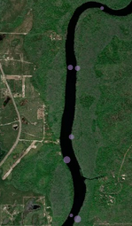

They're small. I'm talking really small considering the power that they bring to the table. In addition, their components (i.e., battery, antenna, etc.) are small. These could be extremely useful on a variety of species.

{width=60% height=60%}

We decided to put a few together to test their capability. We setup a little assembly/engineering area in my office, and we got to work. We (very carefully) put the first transmitter together! We actually needed a magnifier to see the board's layout! 

{width=60% height=60%}

The board itself is pretty versatile with several key ports, including a USB-c for upload/download of data/programming. I think there is a SSD in there somewhere!

{width=60% height=60%}

This receiver uses multiple satellite systems (GPS, Galileo, BeDou), and only needs 12 ms to get a position fix! However, the most impressive thing to me: the low cost and low power consumption. These little units could run for > 2 years on a small 110 mAh battery, and the units are currently < $100, including the board, battery, and GPS antenna. 

Once we plugged the battery into the board, programming the unit was about as easy as it gets. You can literally program these units in a web browser. We had the receiver take our locality every 15 mins for about 2 hours.They can be programmed to start tracking on a certain date/time, which is a great feature. We actually placed the unit in a small pelican case and took it for a boat ride while we sampled passive fishing lines/hooks along the banks of the Suwannee River. After we returned, we uploaded our data to the SnapperGPS website, and it quickly processed our locality data. It worked to perfection! It even produced a map of our locations with the associated uncertainty (purple circles below). 

{width=65% height=65%}

Overall, this unit provides some really great features, and it is extremely inexpensive considering its capabilities. Some points below:

* small
* affordable
* great memory (>10,000 fixes)
* easy to use
* very efficient

We're excited to have the opportunity to use these units on turtles in 2023! Check back for updates!

To read more about this receiver please visit the SnapperGPS's [Github](https://github.com/SnapperGPS) or visit their website [here](https://snappergps.info/). Be sure to follow them on [Twitter](https://twitter.com/SnapperGPS) for updates!

Thanks to Amanda Matthes and the entire SnapperGPS team at [Oxford University](https://www.ox.ac.uk/) !!!

