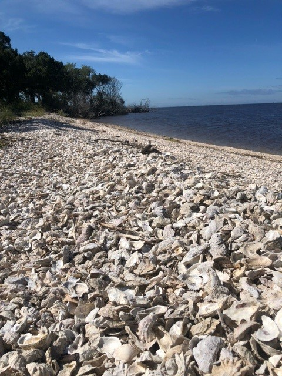
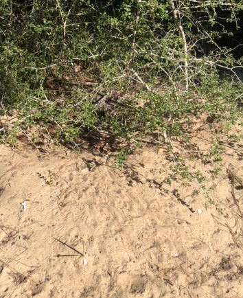
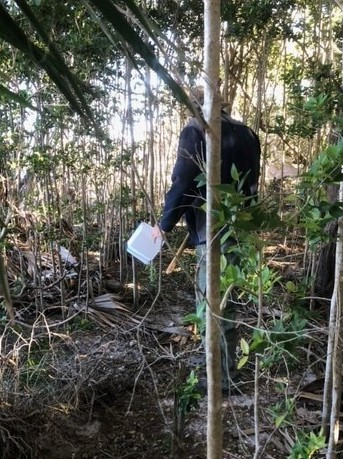
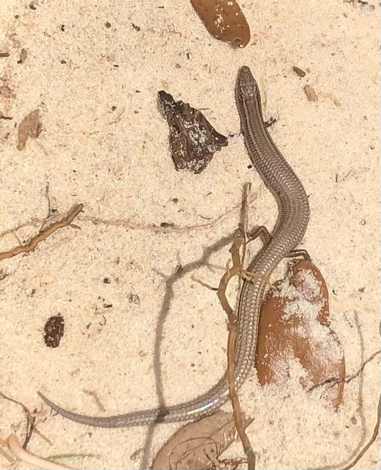
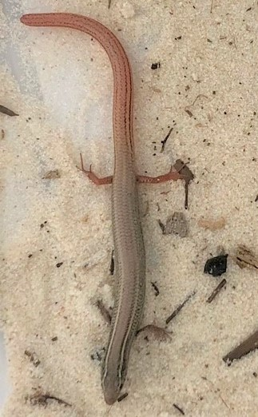

### Our latest survey for Cedar Key Mole Skinks

A team of researchers (Kevin Enge, Paul Moler, Mark Robertson, Jamie Barichivich, Matt Fedler, Jake Scott, and yours truly) embarked from UF/NCBS on a journey to locate Cedar Key Mole Skinks on undocumented islands in the Suwannee Estuary. The Cedar Key Mole Skink is a fossorial lizard that is endemic to the sandy beaches of islands in the Suwannee Estuary. This species is undergoing a status assessment, thus better understanding its range is critical for any decision on its conservation status. We headed North towards the mouth of the Suwannee River to search islands that potentially have undocumented populations. 

Off we go with Captain Kenny!

Two of the islands appeared to have suitable beach habitats; however, the island's "beach" habitat was just shell fragments. In fact, oyster shell reflects sunlight and resembles white sand beach in satellite images, so some of islands we targeted for surveys actually lacked appropriate beach habitat.  

We found some good looking habitat on one island, which interestingly had gopher tortoise burrows. This indicates that this island has decent elevation. Unfortunately, our manual surveys came up empty, but the team assessed that this island holds some potential. Perhaps we will return with drift fences. 

The next few islands were significantly eroded or lacked appropriate beach habitat. We searched them anyway!

Finally, we found some good looking habitat on the last island, which did have a locality record in 2004; however, this record was not vouchered or photographed. We searched for about 5 minutes, and BAM! Jake Scott strikes gold with a beautiful silver colored adult male Cedar Key Mole Skink.

A few minutes later, Jake strikes again. This time a younger male with a pinkish tail. Outstanding!

In total, we captured 3 skinks on our last island. Kevin got a voucher photograph and collected a DNA sample. Mission accomplished. Overall, our trip had mixed results, and while many islands were found to be unsuitable, we did locate one island that has some potential. We hope to return to this island next year for a more thorough survey. 

 