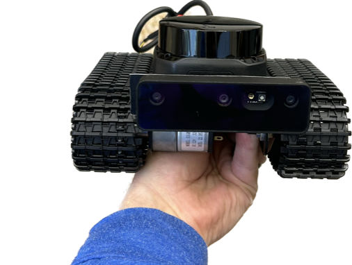
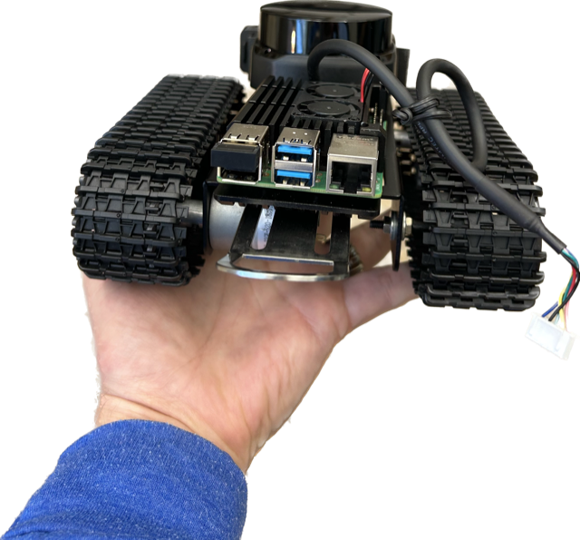

The burrow robot is a small, tracked robotic platform that incorporates a microcomputer (raspberry pi 4b 8GB RAM) and advanced sensors that will allow us to better investigate the underground environment of burrowing species, especially gopher tortoises. The prototype is appropriately 15cm wide and 8cm tall, which allows it to investigate most adult gopher tortoise burrows. 

The platform is packed with technologies that allow it to measure and record environmental parameters. The robot is equipped with a small powerful AI capable camera system (Luxonis) that can potentially identify (with training) wildlife species and possible even individuals. In addition, the small robot possess a small Lidar (Slamtec S2) unit that helps the vehicle navigate and scan its surroundings. 

The on-board microcomputer/sensors interface in concert with a robotic operating system (ROS2), and the robot is designed to be controlled with a single laptop via an Ethernet cable. It can be tethered to a power source that can supply hours and hours of operation. However, future iterations could be operated wireless with on-board power supplies.  

Front view

Back view

We hope to start beta testing in summer 2023, so check back for updates!

