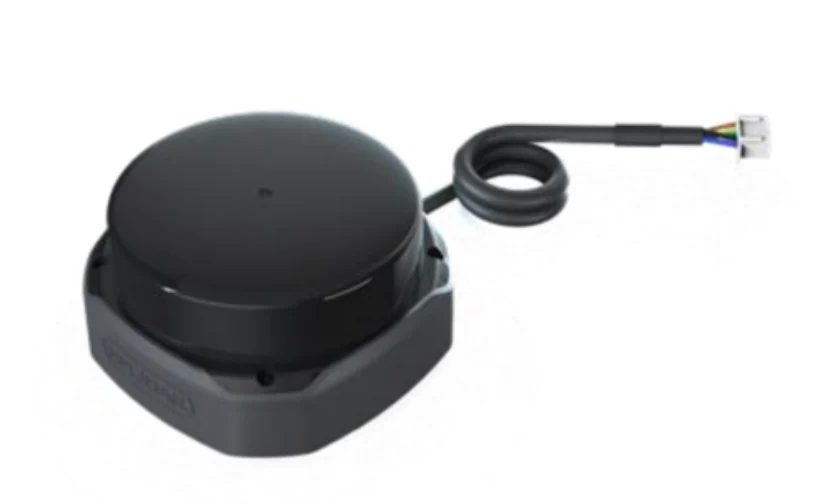
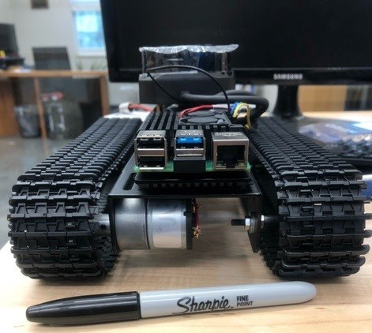

The burrow robot is a small, tracked platform that incorporates microcomputers and advanced sensors that will allow us to better investigate the underground environment of burrowing species, especially gopher tortoises. The prototype is appropriately 15cm wide and 10cm tall, which allows it to investigate most adult gopher tortoise burrows. 

The platform is packed with technologies that allow it to measure and record environmental parameters. The robot is equipped with a raspberry pi 4b and incorporates a small powerful RPLidar to navigate and scan its surroundings. The computer and sensors are powered by a 25000 mAh rechargeable battery.  

The raspberry pi 4b interfaces with a robotic operating system (ROS) in the python language, and can be controlled wireless or with a small Ethernet cable (for high speed data transfer). The robot is designed to be controlled with a single laptop, and future iterations will incorporate AI technology.

We are in beta testing now so check back for updates!

