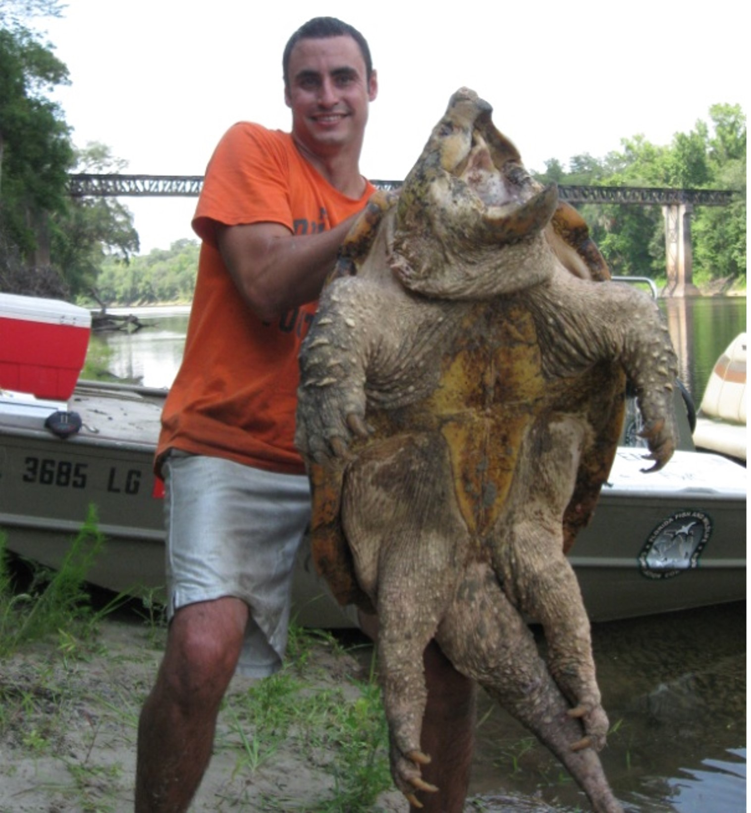

The Suwannee Alligator Snapping Turtle is an iconic species of freshwater megafauna that is endemic to the Suwannee River in Georgia and Florida. This species is listed as state "threatened" and is currently being considered for listing on the endangered species act. To better understand this species population status in Florida, we initiated a longterm capture-mark-recapture study in the Suwannee River in Florida. To date, we have captured ~200 individual turtles, and our models estimate high survival for adults. 

We used a stage based projection matrix model to estimate population growth rates, and this model suggested that the population is near stable but could be in slight decline. More research is needed to reduce the amount of uncertainty around our estimates. In addition, our model needs species/site specific estimates of clutch size, nesting success, hatching survival (age 0-1). Our research continues with the help of a state wildlife grant. [Read our latest paper on population status here](https://meridian.allenpress.com/ccb/article-abstract/21/1/2/483147/Population-Status-of-the-Suwannee-Alligator)  

