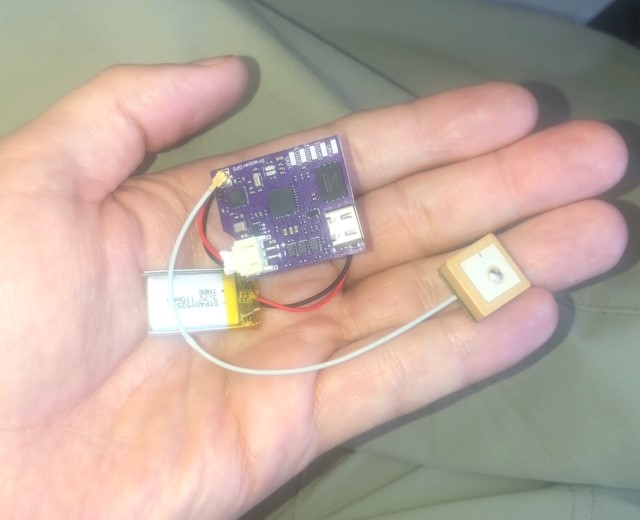
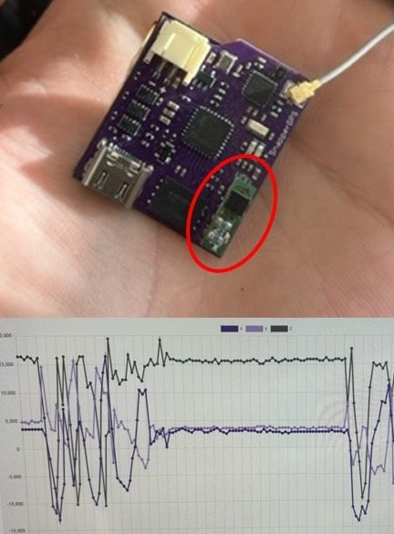

Many species of turtles are cryptic species, so much of their behaviors are poorly understood. While satellite and GPS tags have been used on marine turtles for decades, these units are often large, power hungry, and extremely expensive. Our colleagues at the University of Oxford have designed/developed a novel GNSS receiver: SnapperGPS. This PCB is a small, low cost, low power GNSS receiver for tracking wildlife. The PCB themselves are just a few cm in size, and they can typically operate for > 1 year on a small LiPo battery. Our partners at Oxford University gave us some of these new units to test out.

In 2023, the SnapperGPS team incorporated other draughtboards that can be soldered on to SnapperGPS boards to provide more information. For example, the units can be paired with an accelerometer, which allows users to obtain location fixes along with information on movement behavior in a x, y, z dimension.   

This year we are planning on equiping several turtle and tortoise species (e.g., Alligator Snapping Turtles, Gopher Tortoises, River Cooters, etc.) with SnapperGPS receivers to better understand their movements and behaviors. SnapperGPS receivers can operate > 1 year on a 100 mAh battery and can record up to 21,000 position fixes (V2.0). These receivers can obtain a position fix in 12 ms! 

We sincerely thank Amanda Matthes and Jonas Beuchert and the SnapperGPS team for their efforts and for allowing us to be some of the first to test this amazing technology. For info on SnapperGPS click [here](https://snappergps.info/), and to read the SnapperGPS team's latest paper Matthes et al. (2022) click [here]( https://ora.ox.ac.uk/objects/uuid:c9acf083-d5e5-4265-8425-67509c5e3b9b) 

